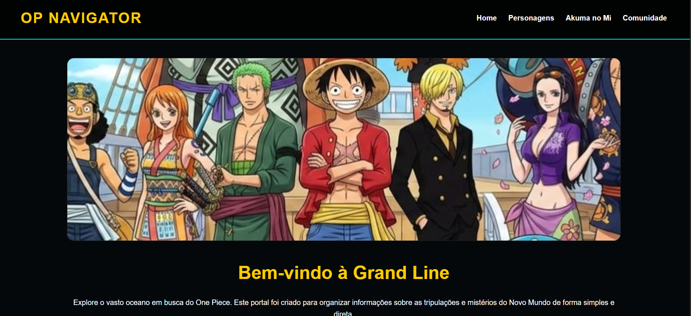
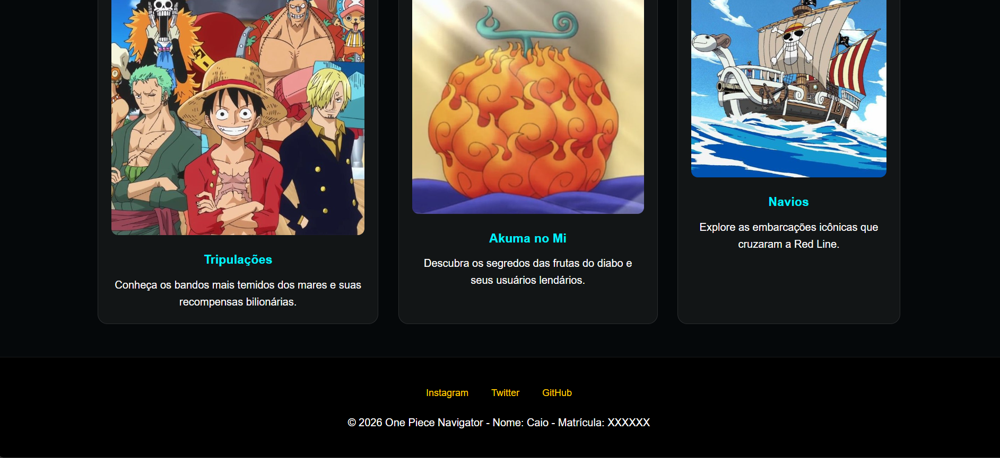
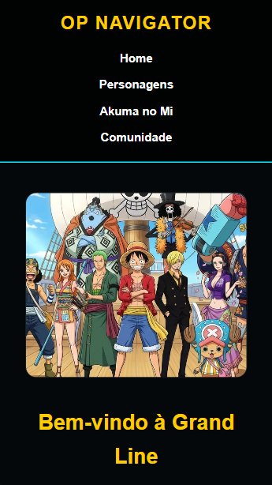
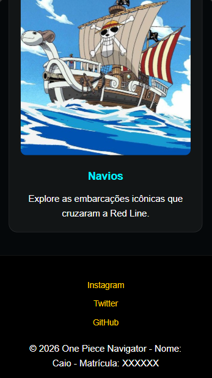

# # One Piece Navigator - Home Page Responsiva

## Dados do Aluno
- **Nome:** Caio Martins Caldeira
- **Matrícula:** 907684
- **Projeto:** Sistema de informações sobre o universo de One Piece (Proposta 5).

## Tecnologias Utilizadas
- **HTML5:** Tags semânticas para melhor acessibilidade e SEO.
- **CSS3 Puro:** Implementação de Layouts com **Flexbox** e **Media Queries** (Sem frameworks).
- **Git/GitHub:** Controle de versão gradual com uso de tags.

## Responsividade (CSS Puro)

O projeto foi desenvolvido seguindo a estratégia de adaptação de layout:
- **Desktop:** Menu horizontal e cards em 3 colunas.
- **Mobile:** Menu vertical e cards em coluna única (100% de largura).

### Demonstração Desktop

### Demonstração Mobile

---
*Projeto acadêmico - 2026*